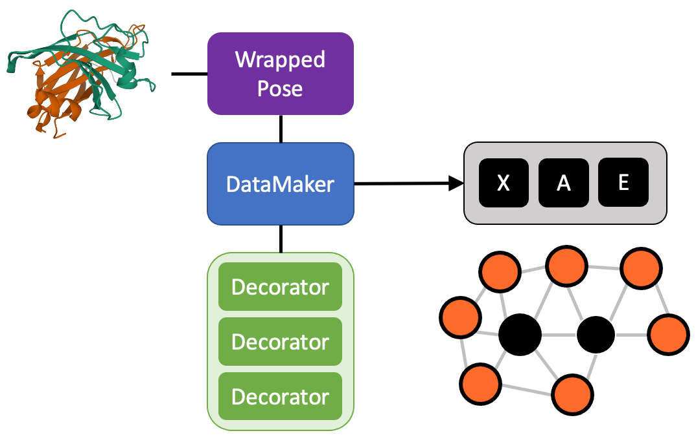

DataMaker
==========

The DataMaker is the main character of Menten GCN.
It has the job of applying decorators to poses and organizing them as tensors.

.. autoclass:: menten_gcn.DataMaker

   .. automethod:: summary

      .. code-block:: python

	 import menten_gcn as mg
	 import menten_gcn.decorators as decs

	 decorators=[ decs.SimpleBBGeometry(), decs.Sequence() ]
	 data_maker = mg.DataMaker( decorators=decorators, edge_distance_cutoff_A=10.0, max_residues=15 )
	 data_maker.summary()

      .. code-block::

	 Summary:

	 23 Node Features:
	 1 : 1 if the node is a focus residue, 0 otherwise
	 2 : Phi of the given residue, measured in radians. Spans from -pi to pi
	 3 : Psi of the given residue, measured in radians. Spans from -pi to pi
	 4 : 1 if residue is A, 0 otherwise
	 5 : 1 if residue is C, 0 otherwise
	 6 : 1 if residue is D, 0 otherwise
	 7 : 1 if residue is E, 0 otherwise
	 8 : 1 if residue is F, 0 otherwise
	 9 : 1 if residue is G, 0 otherwise
	 10 : 1 if residue is H, 0 otherwise
	 11 : 1 if residue is I, 0 otherwise
	 12 : 1 if residue is K, 0 otherwise
	 13 : 1 if residue is L, 0 otherwise
	 14 : 1 if residue is M, 0 otherwise
	 15 : 1 if residue is N, 0 otherwise
	 16 : 1 if residue is P, 0 otherwise
	 17 : 1 if residue is Q, 0 otherwise
	 18 : 1 if residue is R, 0 otherwise
	 19 : 1 if residue is S, 0 otherwise
	 20 : 1 if residue is T, 0 otherwise
	 21 : 1 if residue is V, 0 otherwise
	 22 : 1 if residue is W, 0 otherwise
	 23 : 1 if residue is Y, 0 otherwise

	 2 Edge Features:
	 1 : 1.0 if the two residues are polymer-bonded, 0.0 otherwise
	 2 : Euclidean distance between the two CB atoms of each residue, measured in Angstroms. In the case of GLY, use an estimate of ALA's CB position
		   
   .. automethod:: get_N_F_S

   .. automethod:: generate_input_for_resid

   .. automethod:: generate_input

   .. automethod:: generate_XAE_input_layers

   .. automethod:: make_data_cache

		   
