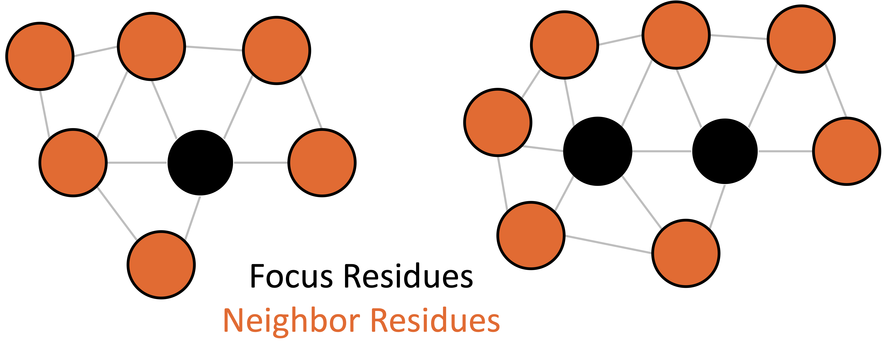
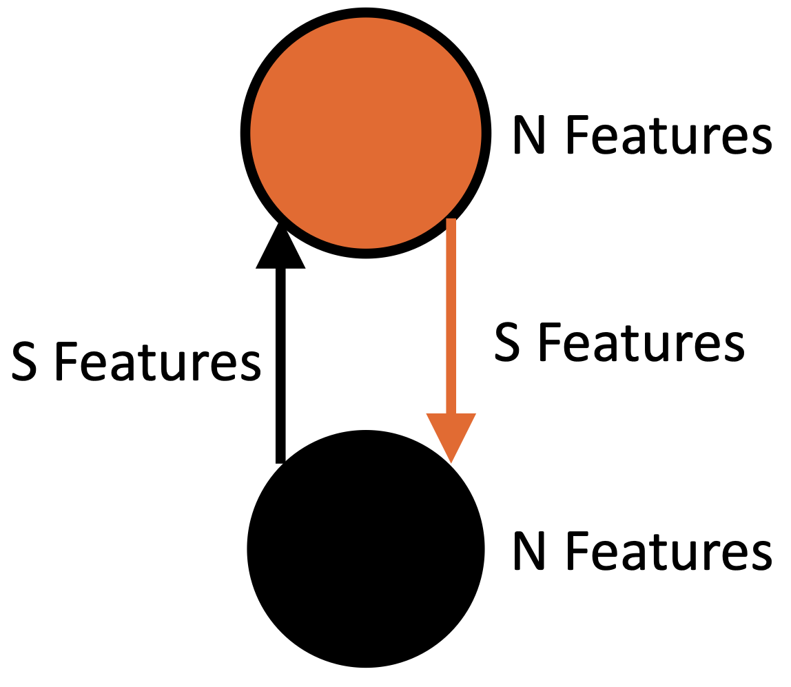
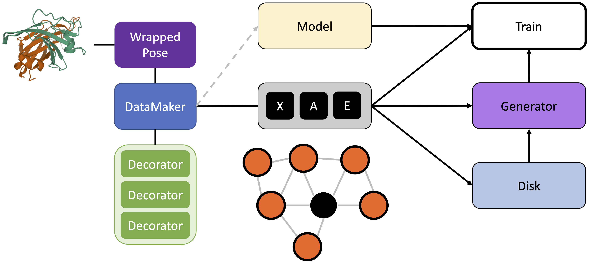

========
Overview
========

The goal of Menten GCN is to create GCN tensors from protein models (poses).
We are aligning with Spektral's vocabulary style when talking about GCNs
and Rosetta's vocabulary when talking about poses.

Prerequisite Knowledge
######################

This overview assumes general familiarity with
protein structure,
machine learning,
graph data structures,
and graph neural networks (to a small extent).

This is a very niche intersections of fields
so do not feel bad if you are not up to speed on all of these topics.
If you find yourself in that position, here are some links that might help:

Protein Structure:
- `Wikipedia <https://en.wikipedia.org/wiki/Protein_structure>`_
- `Amino Acids <https://en.wikipedia.org/wiki/Amino_acid>`_
- `Phi and Psi <https://proteopedia.org/wiki/index.php/Phi_and_Psi_Angles>`_
- `Rosetta <https://www.rosettacommons.org/support/overview>`_

Machine Learning:
- `Machine Learning <https://en.wikipedia.org/wiki/Machine_learning>`_
- `Neural Networks <https://en.wikipedia.org/wiki/Artificial_neural_network>`_
- `Graph Convolutional Neural Networks <https://tkipf.github.io/graph-convolutional-networks/>`_
- `Spektral <https://graphneural.network/>`_

Graph Layout
###############

Each node (vertex) in our graph represents a single residue position.
Edges connect nodes that are close in 3D space.
Our goal in Menten GCN is to analyze small pockets of residues at a time,
though the size of each pocket is entirely up to the user and can encompass the entire protein if you wish.

We generate a graph by first declaring one or more "focus" residues.
These residues will be at the center of our pocket.
Menten GCN will automatically select the residue positions closest in space
to the focus residues and will use them to build neighbor nodes.
Menten GCN will also automatically add edges between any two nodes that are close in space.

Graph Tensors
#############

We are basing our format off of Spektral's batch mode.

We have 3 primary parameters in this system:

- "N" is maximum the number of nodes in any graph.
  This includes focus nodes and neighbor nodes
- "F" is the number of features per node
- "S" is the number of features per edge  
  
These parameters are used to define 3 input tensors:

- Tensor "X" holds the node features and is of shape (N,F)
- Tensor "A" holds the adjacency matrix and is of shape (N,N)
- Tensor "E" holds the edge features and is of shape (N,N,S)

One nuance of the "E" tensor is that edges can have direction.
Every pair of residues has room for two edge tensors in our system.
Some of our edge features are symmetric (like distance) so they will
have the same value going in both directions.
Other edge tensors are asymmetric (like relative geometries) so they
will have different values for each of the two slots in "E".

Usage
#####

This workflow may be overwhelming but keep in mind that this is the entire training process.
Let's walk through this slowly:

1. Start by loading your pose in python using any of our supported packages.

  - Just Rosetta and MDTraj right now. Get in touch if you want more!
  - You will hopefully be training on more than just one pose
    
2. Wrap your pose using the appropiate wrapper for your package.

  - See Classes -> Pose Wrappers
    
3. Define a list of decorators to use to represent your pose.

  - See Classes -> Decorators
  - An example decorator would be PhiPsiRadians,
    which decorates each node with its Phi and Psi value
    
4. Use this list of decorators to build a DataMaker
   
5. The DataMaker will then take your wrapped pose, ask for the focus residues, and return the X, A, and E tensors
   
6. From here you have a few choices.

   - You can train on these tensors directly
   - You can train on these tensors after wrapping them in a Keras generator
     - See Classes -> Data Management
   - Or you can save these for later. Stick them on disk and come back to them when you're ready to train
     
7. Of course in order to train you need to create a model.

   - Menten GCN doesn't do much in that regard.
     We highly recommend Spektral for this purpose.
   - However, we do recommend using the DataMaker to generate the input layers for your model.
     This ensures that the size and shape matches the data

   
See the DataMaker class and examples for more details.
